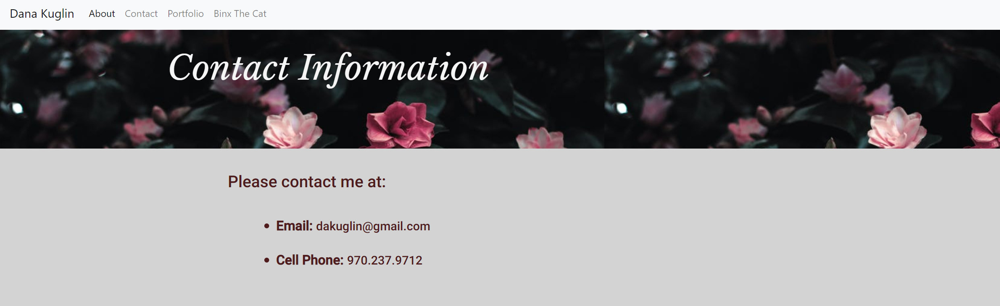
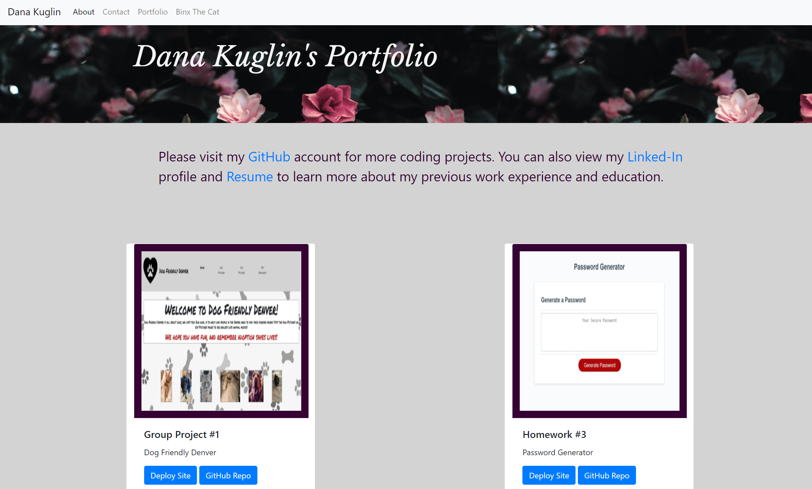
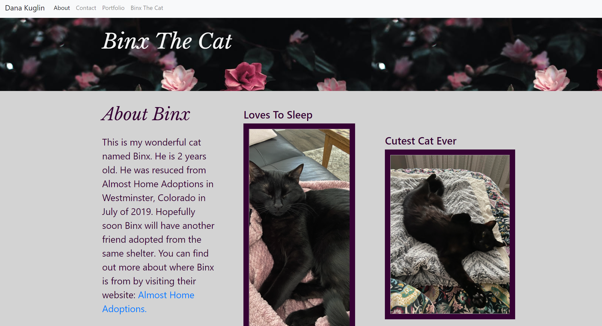

# Biohomework02: Responsive Portfolio 

## Overview

* I have created a responsive portfolio with several different Bootstrap components. The purpose of this homework was to familiarize us with the many different aspects of boostrap and all of the amazing things it can do for your webpage. It can really help you organzie your tables and columns across a page and makes building webpages extremely very easy to be responsive to different screen sizes. 

* By utilizing some aspects of bootstrap across my html's I have solved the issue of using the floating styling in CSS. Bootstrap grids help with the overall layout of the webpage. They make it easy to format things with the use of rows and columns, and they are also help with responisvness.

* I have updated my contact page and portfolio page with a phone number, GitHub link, resume link, and linked-in profile. I have also added links to deployable homeworks and group projects, as well as links to the github accounts.  

### Walk Through

The About me profile page is a small introduction to who I am. 

The contact page contains my contact information.

The portfolio page contains links to my GitHub, Linked-In, and Resume. It also has links to project 1 and three homeworks (where site is deployed and github).

Binx the cat is a tab all about my adorable cat Binx and the shelter I adopted him from. 

### Project Links
Group Project 1: https://queek1313.github.io/DogFriendlyDenver/
Homework 3: https://dakuglin.github.io/password-generator-03/
Homework 4: https://dakuglin.github.io/codequiz04/
Homework 6: https://dakuglin.github.io/work-day-scheduler05/

### Authors
The Dog Friendly Denver application was created by Tony Nolan, Dana Kuglin, Joshua Thompson, Katie Anilionis, Brenda Miller and Anna Battista.

All other applications were created by Dana Kuglin. 

### Features of my homework

* My code utulized Bootstraps grid system (containers, rows, and columns)

* Utilizes Bootstrap navigation bar across all pages

* Utilizes Boostrap jumbotron with image added in CSS for looks 

* Utilizes Bootstrap resposive images.
